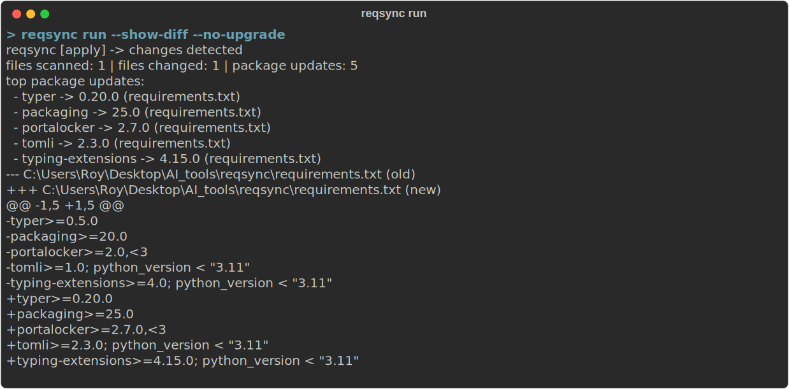

# reqsync

Keep your `requirements.txt` (and included requirement files) synced to what is actually installed — fast, safe, and low-effort.

> Built for the "I just want my requirements file updated" workflow.

[](https://pypi.org/project/reqsync/)
[](https://pypi.org/project/reqsync/)
[](https://github.com/ImYourBoyRoy/reqsync/actions/workflows/ci.yml)
[](https://opensource.org/licenses/MIT)

---

## What reqsync is

`reqsync` reads your active environment and rewrites requirement specifiers so files reflect what you're currently running.

- Preserves comments, extras, markers, and line endings.
- Follows `-r` includes.
- Skips `-c` constraints unless you opt in.
- Uses backups + atomic writes.

### What reqsync is not

- Not a lockfile manager.
- Not a dependency solver replacement.
- Not a hash-regenerator for `--hash` pinned lines.

---

## Install

```bash
pip install reqsync
```

Optional extras:

```bash
pip install "reqsync[mcp]"      # built-in MCP server support
pip install "reqsync[pretty]"   # optional pretty ecosystem deps
```

---

## Quick start

```bash
# 1) Preview only (no writes)
reqsync run --no-upgrade --dry-run --show-diff

# 2) Apply updates
reqsync run --show-diff

# 3) CI drift gate (fails if changes needed)
reqsync run --check --no-upgrade
```

### Before / after example

```txt
# before
requests>=2.30.0
pydantic>=2.5.0

# after (installed env has requests 2.32.3, pydantic 2.7.0)
requests>=2.32.3
pydantic>=2.7.0
```

---

## Terminal demos

### Quick sync preview (`--dry-run --show-diff`)

<p>
  
</p>

### CI check mode (`--check --no-upgrade`)

<p>
  
</p>

---

## Integration Guide

### Standalone usage

```bash
reqsync run --path requirements.txt
reqsync run --path requirements/base.txt --follow-includes
```

### Agentic / MCP usage

```bash
# MCP server (stdio)
reqsync mcp

# or dedicated entrypoint
reqsync-mcp
```

### Python API (tool-friendly)

```python
from reqsync.api import run_sync_payload

result = run_sync_payload(
    {
        "path": "requirements.txt",
        "dry_run": True,
        "no_upgrade": True,
        "show_diff": True,
        "policy": "lower-bound",
    }
)
print(result["changed"])
print(result["changes"])
```

---

## Core commands

```bash
reqsync run [OPTIONS]
reqsync help [all|run|version|mcp]
reqsync --version
reqsync version
reqsync mcp [--transport stdio|sse|streamable-http]
```

Most-used options:

- `--path`
- `--no-upgrade`
- `--dry-run`
- `--check`
- `--show-diff`
- `--output human|json|both`
- `--json-report <file>`
- `--backup-keep-last <n>` (default `5`)
- `--policy lower-bound|floor-only|floor-and-cap|update-in-place`

Help discoverability:

```bash
reqsync help all
reqsync run --help
reqsync mcp --help
```

---

## Common workflows

```bash
# quick local refresh
reqsync run --show-diff

# no network / no pip upgrade
reqsync run --no-upgrade --dry-run --show-diff

# machine output for tools/models
reqsync run --no-upgrade --dry-run --output json

# update constraints too
reqsync run --path requirements/base.txt --update-constraints
```

---

## Output shape (for models/tools)

`--output json` or Python API returns structured keys:

- `changed`
- `files` (with `role`, `changed`, `change_count`)
- `changes` (`file`, `package`, `installed_version`, `old_line`, `new_line`)
- `backup_paths`
- `diff`

---

## Safety model

- Blocks outside virtualenv unless `--system-ok`.
- Blocks hash-pinned files unless `--allow-hashes`.
- Optional dirty-repo guard via `--allow-dirty`.
- Lock + backup + atomic write for safer file operations.
- Timestamped backups are auto-pruned (keep latest 5 per file by default).

---

## Docs

- [Usage](docs/USAGE.md)
- [Configuration](docs/CONFIG.md)
- [Integration](docs/INTEGRATION.md)
- [Changelog](CHANGELOG.md)

---

## Author & Links

**Created by**: Roy Dawson IV  
**GitHub**: <https://github.com/imyourboyroy>  
**PyPi**: <https://pypi.org/user/ImYourBoyRoy/>

Project repo: <https://github.com/ImYourBoyRoy/reqsync>

---

## License

MIT — see [LICENSE](LICENSE).
